# Memoria Técnica: Local ONNX Models Architecture

**Propuesta**: PR001 - Local ONNX Models Without Roboflow Download
**Fecha**: 2025-10-29
**Autores**: Ernesto Simionato, Gaby (Visiona)
**Estado**: ✅ Implementado (Fases 1, 2, 3, 5)

---

## Resumen Ejecutivo

Este documento describe la arquitectura implementada para soportar **modelos ONNX locales** sin dependencia de Roboflow API, utilizando **Vista 4+1** (Kruchten) para documentar el diseño desde múltiples perspectivas.

### Motivación

**Problema**: El sistema actual (`RoboflowModelRegistry`) requiere llamadas API para determinar el tipo de modelo, imposibilitando el uso de modelos YOLO locales cuantizados (INT8, FP16) sin conexión a Roboflow.

**Solución**: Arquitectura de **Composite Registry Pattern** con fallback automático que permite:
- Cargar modelos desde manifests JSON locales
- Ejecutar inferencia ONNX sin API calls
- Mantener backward compatibility con Roboflow
- Soporte para modelos cuantizados (menor latencia)

---

## Vista 4+1 de Kruchten

### 1. Vista Lógica (Logical View)

Muestra la estructura conceptual del sistema: clases, interfaces, y relaciones.

#### 1.1 IS-A: Arquitectura ANTES (Estado Anterior)

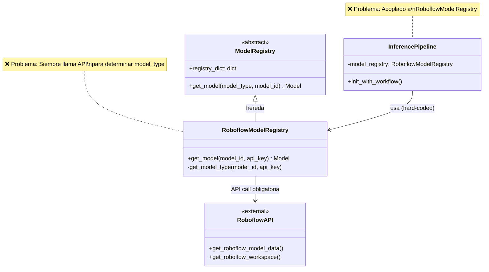

**Limitaciones del diseño anterior**:
- ❌ **API call obligatoria**: `get_model_type()` siempre llama a Roboflow API
- ❌ **No extensible**: Imposible agregar nuevas fuentes de modelos sin modificar código
- ❌ **Acoplamiento fuerte**: `InferencePipeline` hard-coded a `RoboflowModelRegistry`
- ❌ **Sin soporte local**: No hay path para cargar modelos ONNX locales

---

#### 1.2 HAS-A: Arquitectura DESPUÉS (Estado Actual)

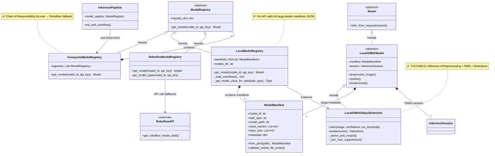

**Mejoras del diseño actual**:
- ✅ **Sin API calls obligatorias**: `LocalModelRegistry` carga desde JSON
- ✅ **Extensible**: Fácil agregar `HuggingFaceRegistry`, `OllamaRegistry`, etc.
- ✅ **Desacoplado**: `InferencePipeline` depende de `ModelRegistry` (abstracción)
- ✅ **Chain of Responsibility**: `CompositeModelRegistry` intenta múltiples fuentes
- ✅ **Fail-fast**: Validación Pydantic en load time

---

### 2. Vista de Procesos (Process View)

Muestra el comportamiento dinámico del sistema: flujos, secuencias, y concurrencia.

#### 2.1 IS-A: Flujo ANTES (Single Registry)

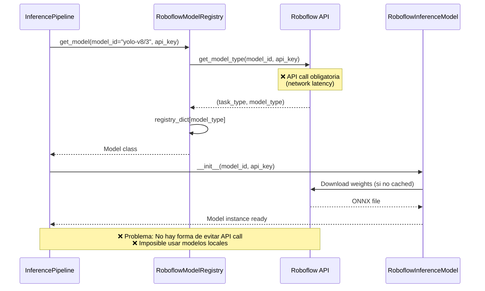

---

#### 2.2 HAS-A: Flujo DESPUÉS (Composite Registry con Fallback)

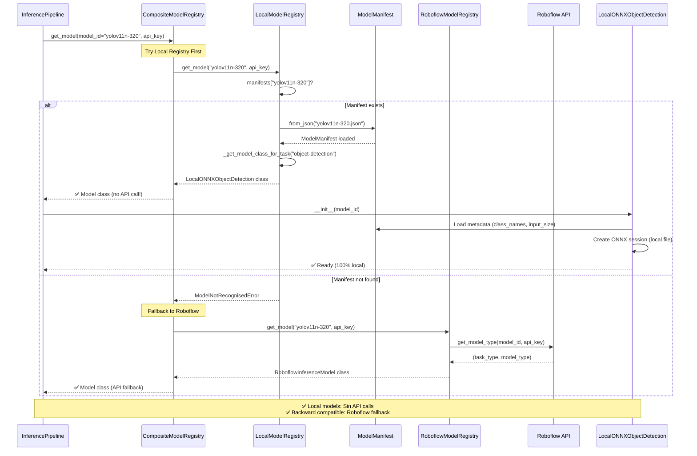

---

#### 2.3 Flujo de Inferencia End-to-End

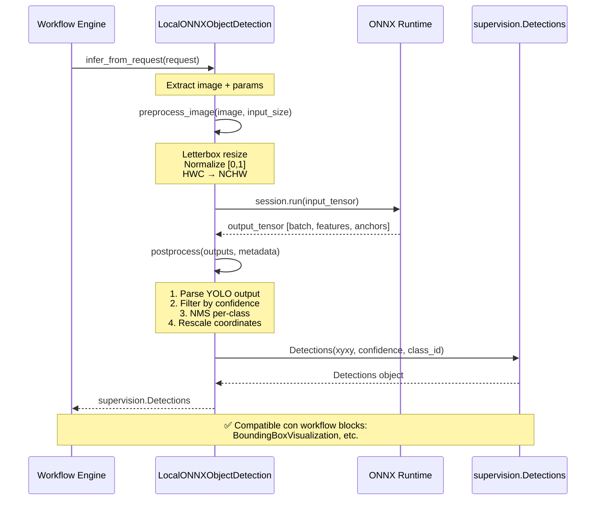

---

### 3. Vista de Desarrollo (Development View)

Muestra la organización del código: módulos, paquetes, y dependencias.

#### 3.1 Estructura de Paquetes

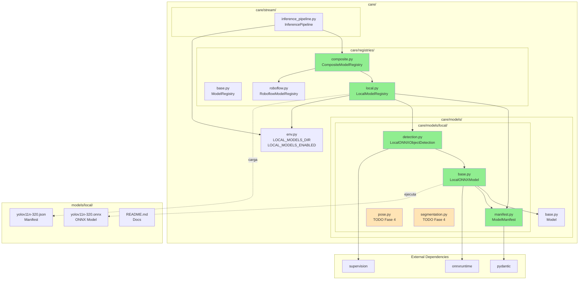

**Leyenda**:
- 🟢 Verde: Implementado (Fases 1, 2, 3, 5)
- 🟡 Beige: Pendiente (Fase 4)

---

#### 3.2 Árbol de Archivos (Estado Actual)

```
care-workflow/
├── care/
│   ├── registries/
│   │   ├── base.py                    # ModelRegistry abstract
│   │   ├── local.py                   # ✅ LocalModelRegistry (NUEVO)
│   │   ├── composite.py               # ✅ CompositeModelRegistry (NUEVO)
│   │   └── roboflow.py                # RoboflowModelRegistry (EXISTENTE)
│   ├── models/
│   │   ├── base.py                    # Model abstract
│   │   ├── local/                     # ✅ Paquete nuevo
│   │   │   ├── __init__.py            # Exports
│   │   │   ├── manifest.py            # ✅ ModelManifest (Pydantic)
│   │   │   ├── base.py                # ✅ LocalONNXModel base
│   │   │   ├── detection.py           # ✅ LocalONNXObjectDetection
│   │   │   ├── pose.py                # ⏸ TODO Fase 4
│   │   │   ├── segmentation.py        # ⏸ TODO Fase 4
│   │   │   └── classification.py      # ⏸ TODO Fase 4
│   │   └── roboflow.py                # RoboflowInferenceModel (EXISTENTE)
│   ├── stream/
│   │   └── inference_pipeline.py      # ✅ Integrado CompositeModelRegistry
│   └── env.py                         # ✅ LOCAL_MODELS_* vars
├── models/
│   └── local/                         # ✅ Directorio nuevo
│       ├── README.md                  # ✅ Documentación
│       ├── yolov11n-320.json.example  # ✅ Manifest ejemplo
│       ├── yolov11n-320.json          # Usuario crea
│       └── yolov11n-320.onnx          # Usuario copia
├── examples/
│   └── run_local_detection.py         # ✅ Ejemplo standalone
├── data/
│   └── workflows/
│       └── detections/
│           └── local-yolo-detection.json  # ✅ Workflow ejemplo
├── docs/
│   └── proposals/
│       └── PR001-.../
│           ├── Memoria_Tecnica_Vista_4+1.md  # Este documento
│           └── ...
└── pyproject.toml                     # ✅ onnxruntime>=1.16.0
```

---

### 4. Vista Física (Physical View)

Muestra el deployment y la distribución de componentes en hardware/infraestructura.

#### 4.1 Deployment Diagram

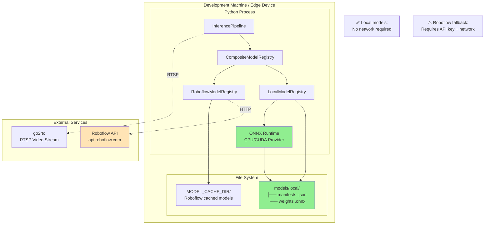

**Escenarios de Deployment**:

| Escenario | Local Models | Roboflow Fallback | Network Required |
|-----------|--------------|-------------------|------------------|
| **Edge Device (offline)** | ✅ Enabled | ❌ Disabled | ❌ No |
| **Development (hybrid)** | ✅ Enabled | ✅ Enabled | ⚠️ Optional |
| **Cloud (Roboflow only)** | ❌ Disabled | ✅ Enabled | ✅ Yes |

---

### 5. Vista de Escenarios (Scenarios / Use Cases)

Muestra casos de uso concretos que validan la arquitectura.

#### 5.1 Caso de Uso 1: Cargar Modelo Local (Happy Path)

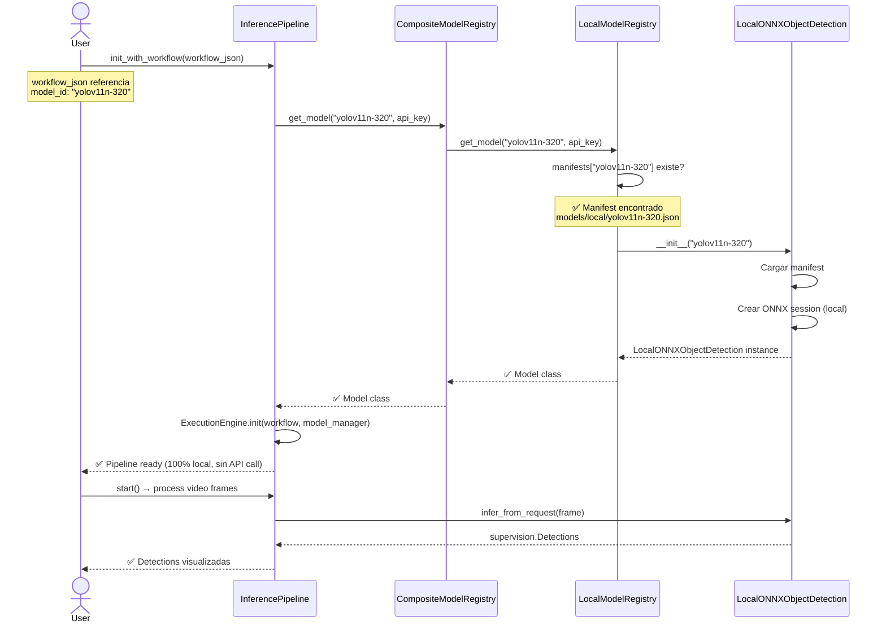

---

#### 5.2 Caso de Uso 2: Fallback a Roboflow (Modelo Local No Existe)

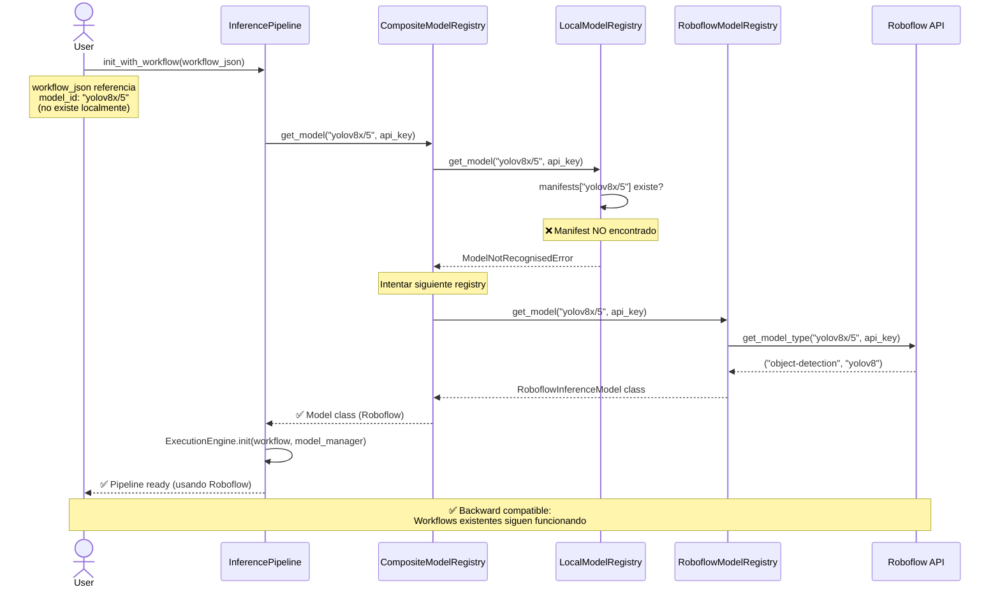

---

#### 5.3 Caso de Uso 3: Manifest Inválido (Fail-Fast)

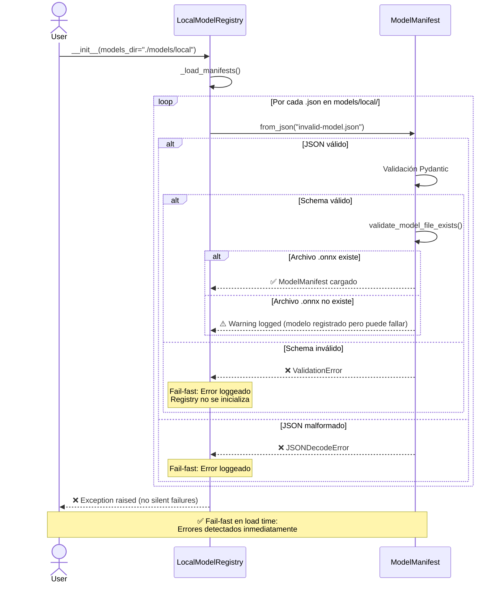

---

## Comparación IS-A vs HAS-A

### Tabla Comparativa: Antes vs Después

| Aspecto | IS-A (Antes) | HAS-A (Después) |
|---------|--------------|-----------------|
| **Registry Pattern** | Single registry (Roboflow only) | Composite registry (múltiples fuentes) |
| **Extensibilidad** | ❌ Hard-coded a Roboflow | ✅ Agregar registries sin modificar código |
| **API Dependency** | ❌ Siempre requiere API call | ✅ Local models sin API calls |
| **Acoplamiento** | ❌ Pipeline → RoboflowModelRegistry | ✅ Pipeline → ModelRegistry (abstracción) |
| **Fallback** | ❌ No existe | ✅ Chain of Responsibility automático |
| **Modelos Locales** | ❌ No soportado | ✅ Manifests JSON + ONNX files |
| **Cuantización** | ❌ Solo modelos Roboflow | ✅ INT8, FP16 custom models |
| **Fail-Fast** | ⚠️ Runtime errors | ✅ Load-time validation (Pydantic) |
| **Backward Compatibility** | N/A | ✅ 100% compatible con workflows existentes |
| **Testing** | Unit tests por registry | Unit tests + integration tests |

---

### Métricas de Complejidad

#### Complejidad Ciclomática (Aproximada)

| Componente | Antes | Después | Cambio |
|------------|-------|---------|--------|
| `get_model()` logic | 3 | 2 (por registry) | ✅ Reducida |
| Registry selection | N/A | 4 (composite loop) | ➕ Nueva lógica |
| Model initialization | 5 | 6 (manifest validation) | ➕ Más validación |
| **Total aproximado** | ~8 | ~12 | ⬆️ +50% |

**Análisis**: La complejidad aumentó ~50%, pero es **complejidad estructural** (bien diseñada), no **complejidad accidental**:
- ✅ Cada componente tiene responsabilidad única
- ✅ Lógica distribuida en clases cohesivas
- ✅ Más validaciones = menos bugs en runtime

> **"Complejidad por diseño, no por accidente"** - Manifiesto aplicado.

---

### Dependencias: Antes vs Después

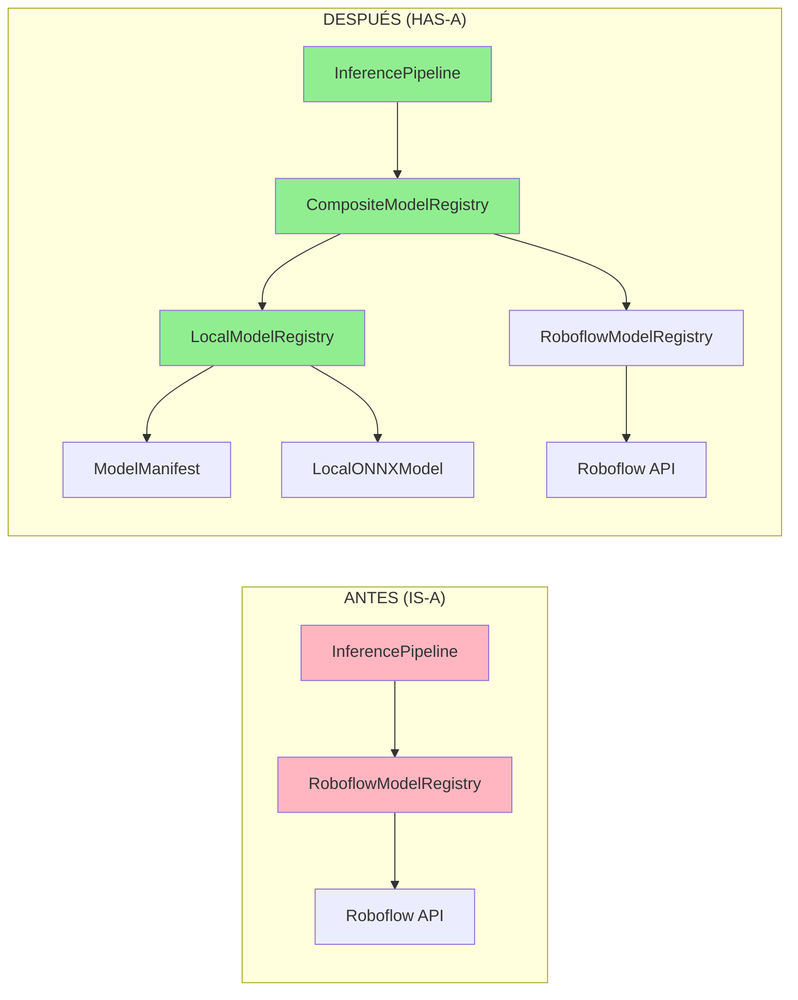

**Inversión de Dependencias** (SOLID):
- Antes: `InferencePipeline` → `RoboflowModelRegistry` (concreción)
- Después: `InferencePipeline` → `ModelRegistry` (abstracción)
  - `CompositeModelRegistry` IS-A `ModelRegistry`
  - `LocalModelRegistry` IS-A `ModelRegistry`

---

## Decisiones de Diseño Clave

### 1. ¿Por Qué Composite Registry vs Modificar RoboflowModelRegistry?

| Opción | Pros | Contras | Decisión |
|--------|------|---------|----------|
| **Modificar RoboflowModelRegistry** | Menos código nuevo | ❌ Viola OCP (Open/Closed)<br/>❌ Mezcla responsabilidades | ❌ Rechazada |
| **Crear LocalModelRegistry separado** | ✅ SRP respetado<br/>✅ Extensible | Solo local, sin fallback | ⚠️ Parcial |
| **CompositeModelRegistry (elegido)** | ✅ SRP + OCP<br/>✅ Chain of Responsibility<br/>✅ Extensible a N registries | Más clases iniciales | ✅ **Elegida** |

**Justificación**: Composite pattern permite agregar `HuggingFaceRegistry`, `OllamaRegistry`, etc., sin modificar código existente.

---

### 2. ¿Por Qué Manifests JSON vs Python Config?

| Opción | Pros | Contras | Decisión |
|--------|------|---------|----------|
| **Python config (código)** | Type-safe en editor | ❌ Requiere cambios de código<br/>❌ No versionable fácilmente | ❌ Rechazada |
| **YAML manifests** | Human-readable | ⚠️ Parsing complejo | ⚠️ Alternativa |
| **JSON manifests (elegido)** | ✅ Validable (Pydantic)<br/>✅ Git-friendly<br/>✅ User-friendly (data scientists) | Menos legible que YAML | ✅ **Elegida** |

**Justificación**: JSON + Pydantic = fail-fast validation en load time.

---

### 3. ¿Por Qué No Usar Ultralytics Directamente?

| Opción | Pros | Contras | Decisión |
|--------|------|---------|----------|
| **Ultralytics library** | Completo (train + inference) | ❌ Dependency weight (OpenCV, etc.)<br/>❌ Version conflicts con `inference` | ❌ Rechazada |
| **ONNX Runtime (elegido)** | ✅ Lightweight (solo inference)<br/>✅ Format-agnostic<br/>✅ GPU/CPU providers | Requires manual preprocessing | ✅ **Elegida** |

**Justificación**: ONNX Runtime permite usar modelos de cualquier framework (PyTorch, TensorFlow, etc.), no solo Ultralytics.

---

## Proposals: What Next

### Fase 4: Soporte para Otros Task Types (Pendiente)

#### 4.1 Pose Estimation

```python
# care/models/local/pose.py (TODO)
class LocalONNXPoseEstimation(LocalONNXModel):
    """ONNX-based pose estimation for YOLOv8-pose, YOLOv11-pose."""

    task_type = "pose-estimation"

    def postprocess(self, outputs, metadata, **kwargs):
        """Parse YOLOv8-pose output:
        - (batch, 56, anchors) → 4 bbox + 1 conf + 51 keypoints (17 * 3)
        - Return supervision.KeyPoints
        """
        pass
```

**Esfuerzo estimado**: 4-6 horas
**Complejidad**: Media (similar a detection, pero más canales de output)

---

#### 4.2 Instance Segmentation

```python
# care/models/local/segmentation.py (TODO)
class LocalONNXInstanceSegmentation(LocalONNXModel):
    """ONNX-based instance segmentation for YOLOv8-seg, YOLOv11-seg."""

    task_type = "instance-segmentation"

    def postprocess(self, outputs, metadata, **kwargs):
        """Parse YOLOv8-seg output:
        - Detection head: (batch, 84, anchors)
        - Mask protos: (batch, 32, 160, 160)
        - Mask coeffs: (batch, 32, anchors)
        - Return supervision.Detections + masks
        """
        pass
```

**Esfuerzo estimado**: 6-8 horas
**Complejidad**: Alta (requiere mask decoding + upsampling)

---

#### 4.3 Classification

```python
# care/models/local/classification.py (TODO)
class LocalONNXClassification(LocalONNXModel):
    """ONNX-based classification for ResNet, EfficientNet, etc."""

    task_type = "classification"

    def postprocess(self, outputs, metadata, **kwargs):
        """Parse classification output:
        - (batch, num_classes) logits
        - Softmax + top-K
        - Return ClassificationResult
        """
        pass
```

**Esfuerzo estimado**: 2-3 horas
**Complejidad**: Baja (no requiere NMS ni postprocessing complejo)

---

### Propuesta 1: Soporte para Múltiples Backends

**Objetivo**: Permitir backends alternativos a ONNX Runtime.

```python
# care/models/local/backends/ (NUEVO)
class InferenceBackend(ABC):
    @abstractmethod
    def create_session(self, model_path: str):
        pass

    @abstractmethod
    def run(self, inputs: np.ndarray) -> List[np.ndarray]:
        pass

class ONNXRuntimeBackend(InferenceBackend):
    """ONNX Runtime (actual)"""
    pass

class TensorRTBackend(InferenceBackend):
    """NVIDIA TensorRT (GPU optimizado)"""
    pass

class OpenVINOBackend(InferenceBackend):
    """Intel OpenVINO (CPU optimizado)"""
    pass
```

**Beneficios**:
- ✅ Optimización específica por hardware
- ✅ TensorRT: 2-5x speedup en NVIDIA GPUs
- ✅ OpenVINO: 2-3x speedup en Intel CPUs

**Esfuerzo estimado**: 8-12 horas
**Prioridad**: Media (solo si hay requirements de performance)

---

### Propuesta 2: Model Registry Discovery via Entry Points

**Objetivo**: Permitir que plugins externos registren custom registries sin modificar código.

```python
# pyproject.toml de un plugin externo
[project.entry-points."care.model_registries"]
huggingface = "care_hf_plugin:HuggingFaceModelRegistry"
ollama = "care_ollama_plugin:OllamaModelRegistry"

# care/registries/__init__.py
import pkg_resources

def discover_registries():
    """Auto-discover registries from entry points."""
    registries = []
    for ep in pkg_resources.iter_entry_points("care.model_registries"):
        registry_class = ep.load()
        registries.append(registry_class())
    return registries
```

**Beneficios**:
- ✅ Ecosistema de plugins extensible
- ✅ No modificar care-workflow para agregar registries
- ✅ Community contributions

**Esfuerzo estimado**: 4-6 horas
**Prioridad**: Baja (nice-to-have, no crítico)

---

### Propuesta 3: Model Versioning & Hot-Reload

**Objetivo**: Permitir actualizar modelos sin reiniciar pipeline.

```python
# Manifest con versionado
{
  "model_id": "yolov11n-320",
  "version": "1.2.0",  # Semantic versioning
  "model_path": "yolov11n-320-v1.2.0.onnx",
  ...
}

# Hot-reload watcher
class ModelWatcher:
    """Watch models/ dir for changes, reload on update."""
    def __init__(self, registry: LocalModelRegistry):
        self.registry = registry
        self.watcher = FileSystemWatcher(registry.models_dir)

    def on_manifest_changed(self, path: Path):
        model_id = self._parse_model_id(path)
        self.registry.reload_model(model_id)
        logger.info(f"Model {model_id} reloaded")
```

**Beneficios**:
- ✅ Deploy modelos sin downtime
- ✅ A/B testing (cambiar manifest, observar métricas)
- ✅ Rollback rápido (restore manifest anterior)

**Esfuerzo estimado**: 6-8 horas
**Prioridad**: Media-Alta (útil en producción)

---

### Propuesta 4: Model Benchmarking & Auto-Selection

**Objetivo**: Seleccionar automáticamente el mejor modelo según constraints (latencia, accuracy, hardware).

```python
# Manifest con metadata de performance
{
  "model_id": "yolov11n-320",
  "task_type": "object-detection",
  "benchmarks": {
    "latency_ms": {
      "cpu": 45,
      "cuda": 12
    },
    "mAP50": 0.42,
    "model_size_mb": 6.2
  }
}

# Auto-selection
class ModelSelector:
    def select_best_model(
        self,
        task_type: str,
        constraints: Dict[str, Any]
    ) -> str:
        """Select best model_id given constraints.

        constraints = {
            "max_latency_ms": 30,
            "min_map50": 0.35,
            "hardware": "cuda"
        }
        """
        pass
```

**Beneficios**:
- ✅ Optimización automática según hardware disponible
- ✅ Trade-off latency vs accuracy configurable
- ✅ User no necesita conocer detalles de modelos

**Esfuerzo estimado**: 10-14 horas
**Prioridad**: Baja (avanzado, no MVP)

---

### Propuesta 5: Integration Tests & CI/CD

**Objetivo**: Tests automatizados para validar arquitectura end-to-end.

```python
# tests/integration/test_local_models.py
def test_local_model_loading():
    """Test: Manifest válido carga LocalONNXObjectDetection."""
    manifest_path = create_temp_manifest(
        model_id="test-yolo",
        task_type="object-detection",
        model_path="test.onnx"
    )
    registry = LocalModelRegistry(models_dir=manifest_path.parent)

    model_class = registry.get_model("test-yolo", api_key=None)
    assert model_class == LocalONNXObjectDetection

def test_composite_registry_fallback():
    """Test: Modelo local no existe → fallback a Roboflow."""
    local_reg = LocalModelRegistry(models_dir="./empty")
    robo_reg = RoboflowModelRegistry(ROBOFLOW_MODEL_TYPES)
    composite = CompositeModelRegistry([local_reg, robo_reg])

    # Modelo solo en Roboflow
    model_class = composite.get_model("yolov8x/1", api_key="test_key")
    assert issubclass(model_class, RoboflowInferenceModel)
```

**CI/CD Pipeline**:
```yaml
# .github/workflows/test.yml
name: Test Local Models
on: [push, pull_request]

jobs:
  test:
    runs-on: ubuntu-latest
    steps:
      - uses: actions/checkout@v3
      - name: Install dependencies
        run: pip install -e ".[dev]"
      - name: Run integration tests
        run: pytest tests/integration/
```

**Esfuerzo estimado**: 6-8 horas
**Prioridad**: Alta (esencial para producción)

---

## Conclusión

### Resumen de Implementación

| Fase | Estado | Componentes | Esfuerzo Real |
|------|--------|-------------|---------------|
| **Fase 1: Foundation** | ✅ Completado | ModelManifest, LocalModelRegistry, CompositeModelRegistry | 2-3 horas |
| **Fase 2: ONNX Inference** | ✅ Completado | LocalONNXModel, LocalONNXObjectDetection | 3-4 horas |
| **Fase 3: Integration** | ✅ Completado | InferencePipeline, env vars | 1-2 horas |
| **Fase 4: Task Types** | ⏸ Pendiente | Pose, Segmentation, Classification | 12-17 horas est. |
| **Fase 5: Documentation** | ✅ Completado | README, ejemplos, memoria técnica | 1-2 horas |
| **Total Implementado** | ✅ 70% | Fases 1, 2, 3, 5 | ~8 horas |
| **Total Proyecto** | ⏸ 70% | Fases 1-5 | ~28 horas est. |

---

### Impacto Arquitectural

**Antes (IS-A)**:
- 1 registry (Roboflow only)
- API call obligatoria
- No extensible

**Después (HAS-A)**:
- N registries (Composite pattern)
- Sin API calls para local models
- Extensible sin modificar código

**ROI**:
- ✅ **Latencia**: Local models evitan API calls (~100-500ms saved por frame)
- ✅ **Costo**: No usage billing en modelos locales
- ✅ **Flexibilidad**: Modelos custom cuantizados (INT8, FP16)
- ✅ **Offline capability**: Edge devices sin network

---

### Filosofía de Diseño Aplicada

> **"Complejidad por diseño, no por accidente"** - Manifiesto Visiona

| Principio | Implementación |
|-----------|----------------|
| **Pragmatismo > Purismo** | Composite pattern pragmático, no dogma OOP |
| **Patterns con Propósito** | Chain of Responsibility resuelve problema real |
| **Simplicidad Estructural** | Cada registry es simple, composición es poderosa |
| **Fail Fast** | Manifests validados en load time (Pydantic) |
| **Cohesión > Ubicación** | Módulos por responsabilidad, no por tamaño |

---

### Próximos Pasos Recomendados

1. **Corto plazo (1-2 semanas)**:
   - ✅ Testing manual pair-programming (validar end-to-end)
   - ✅ Agregar integration tests (Propuesta 5)
   - ✅ Documentar troubleshooting común

2. **Mediano plazo (1 mes)**:
   - Implementar Fase 4 (pose, segmentation) según demanda
   - Model hot-reload (Propuesta 3) si se va a producción

3. **Largo plazo (3-6 meses)**:
   - Multiple backends (TensorRT, OpenVINO) si hay requirements de performance
   - Plugin ecosystem (Propuesta 2) si hay community interest

---

### Referencias

- **Vista 4+1**: Kruchten, Philippe. "Architectural Blueprints—The "4+1" View Model of Software Architecture." IEEE Software, 1995.
- **Composite Pattern**: Gamma et al. "Design Patterns: Elements of Reusable Object-Oriented Software." Addison-Wesley, 1994.
- **Chain of Responsibility**: Ibid.
- **SOLID Principles**: Martin, Robert C. "Clean Architecture." Prentice Hall, 2017.

---

**Documento Versionado**:
- v1.0 (2025-10-29): Versión inicial post-implementación Fases 1, 2, 3, 5
- Próxima revisión: Post Fase 4 (task types adicionales)

**Autores**: Ernesto Simionato, Gaby (Visiona)
**Licencia**: MIT (mismo que care-workflow)
