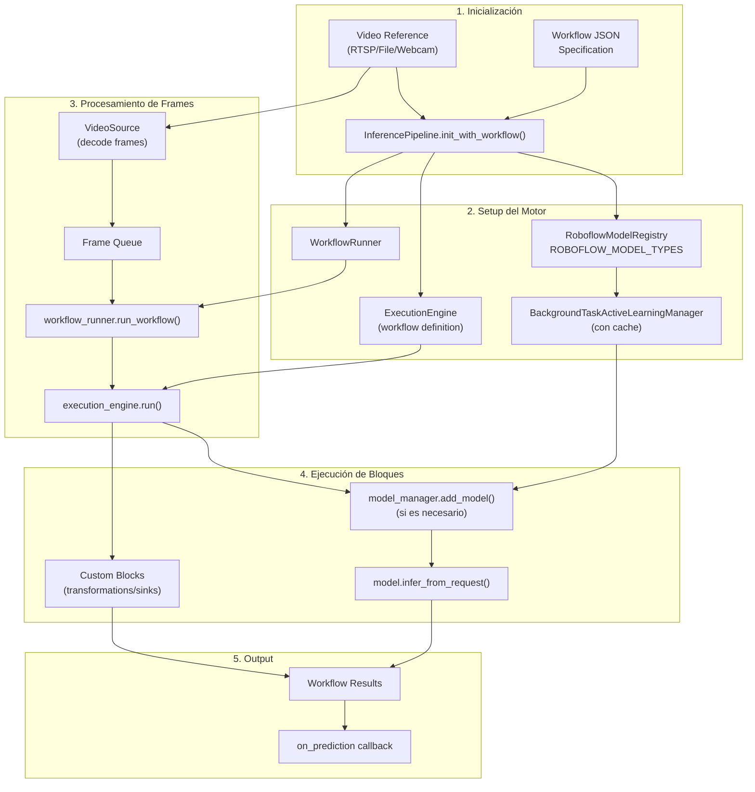

Entiendo que quieres un panorama completo de cómo funciona la gestión, carga y uso de modelos, y cómo se integran con el `InferencePipeline` (stream engine) y los workflows (workflow engine runner).<cite />

## Arquitectura General de Gestión de Modelos

El sistema tiene dos flujos principales para ejecutar modelos: **InferencePipeline** para procesamiento de video en tiempo real y **WorkflowRunner** para workflows declarativos. [1](#1-0) 

### 1. Carga y Registro de Modelos

#### ModelManager y ModelRegistry

El `ModelManager` en `care/managers/base.py` es el orquestador central que mantiene un diccionario de modelos cargados y enruta las solicitudes de inferencia. [2](#1-1)  Utiliza un `ModelRegistry` (como `RoboflowModelRegistry`) para obtener las clases de modelo correctas basándose en el `model_id`. [3](#1-2) 

El registro mapea tipos de modelo a clases concretas en el diccionario `ROBOFLOW_MODEL_TYPES`: [4](#1-3) 

#### Carga de Artefactos

Los modelos heredan de `RoboflowInferenceModel` que gestiona la descarga y caché de artefactos: [5](#1-4) 

El proceso de carga verifica primero el caché local, luego intenta S3, y finalmente la API de Roboflow: [6](#1-5) 

### 2. Integración con InferencePipeline (Stream Engine)

El `InferencePipeline` procesa streams de video en tiempo real. Tiene tres métodos de inicialización principales:<cite />

#### a) init() - Modelos Roboflow Estándar

Carga modelos de detección/clasificación/segmentación de Roboflow directamente. [7](#1-6) 

#### b) init_with_workflow() - Workflows Declarativos

Este es el método más flexible que ejecuta workflows JSON completos: [8](#1-7) 

**Flujo de ejecución:**

1. **Carga de workflow**: Obtiene la especificación JSON (local o desde Roboflow API) [9](#1-8) 

2. **Inicialización del ModelManager**: Crea un `BackgroundTaskActiveLearningManager` con caché de tamaño fijo [10](#1-9) 

3. **Configuración del ExecutionEngine**: Inicializa el motor de workflows con parámetros incluyendo el `model_manager` [11](#1-10) 

4. **WorkflowRunner**: Ejecuta el workflow frame por frame [12](#1-11) 

### 3. Workflow Engine Runner

El `WorkflowRunner` es el puente entre el pipeline de video y el `ExecutionEngine`: [13](#1-12) 

**Proceso:**
1. Recibe frames de video del `InferencePipeline`
2. Construye los parámetros del workflow incluyendo imágenes y metadata
3. Invoca `execution_engine.run()` con los parámetros
4. Retorna los resultados al sink del pipeline

### 4. Carga Dinámica de Modelos en Workflows

Cuando un workflow necesita un modelo, el `ExecutionEngine` usa el `model_manager` inyectado para cargarlo dinámicamente: [14](#1-13) 

El `model_manager.add_model()` verifica si el modelo ya está en caché, y si no, lo carga usando el `ModelRegistry`.<cite />

### 5. Sistema de Plugins para Custom Blocks

Los workflows pueden usar bloques personalizados cargados mediante el sistema de plugins: [15](#1-14) 

Los plugins se activan con la variable de entorno `WORKFLOWS_PLUGINS` y se cargan durante la inicialización del `InferencePipeline`.<cite />

## Diagrama de Flujo Completo



## Notas

- El `ModelManager` usa lazy loading: los modelos solo se cargan cuando se necesitan por primera vez<cite />
- El caché de modelos tiene tamaño fijo (`MAX_ACTIVE_MODELS`) para evitar consumir demasiada memoria [16](#1-15) 
- Los workflows pueden mezclar modelos de Roboflow con bloques personalizados en el mismo pipeline<cite />
- El `ExecutionEngine` es parte de la librería `inference` de Roboflow y maneja la ejecución del grafo de bloques<cite />
- Para modelos locales cuantizados, necesitarías extender el `ModelRegistry` para cargar desde rutas locales en lugar de la API de Roboflow<cite />

Wiki pages you might want to explore:
- [Core Systems Overview (e7canasta/care-workflow)](/wiki/e7canasta/care-workflow#3.1)

### Citations

**File:** care/__init__.py (L1-18)
```python
from typing import TYPE_CHECKING, Any, Callable, Dict

if TYPE_CHECKING:
    from care.stream.inference_pipeline import InferencePipeline
    from care.stream.stream import Stream
    from care.models.base import Model
    from care.models.utils import get_model, get_roboflow_model

_LAZY_ATTRIBUTES: Dict[str, Callable[[], Any]] = {
    "Stream": lambda: _import_from("care.stream.stream", "Stream"),
    "InferencePipeline": lambda: _import_from(
        "care.stream.inference_pipeline", "InferencePipeline"
    ),
    "get_model": lambda: _import_from("care.models.utils", "get_model"),
    "get_roboflow_model": lambda: _import_from(
        "care.models.utils", "get_roboflow_model"
    ),
}
```

**File:** care/managers/base.py (L329-337)
```python
    async def model_infer(self, model_id: str, request: InferenceRequest, **kwargs):
        model = self._get_model_reference(model_id=model_id)
        return model.infer_from_request(request)

    def model_infer_sync(
        self, model_id: str, request: InferenceRequest, **kwargs
    ) -> Union[List[InferenceResponse], InferenceResponse]:
        model = self._get_model_reference(model_id=model_id)
        return model.infer_from_request(request)
```

**File:** care/registries/roboflow.py (L68-99)
```python
    def get_model(
        self,
        model_id: ModelID,
        api_key: str,
        countinference: Optional[bool] = None,
        service_secret: Optional[str] = None,
    ) -> Model:
        """Returns the model class based on the given model id and API key.

        Args:
            model_id (str): The ID of the model to be retrieved.
            api_key (str): The API key used to authenticate.

        Returns:
            Model: The model class corresponding to the given model ID and type.

        Raises:
            ModelNotRecognisedError: If the model type is not supported or found.
        """
        model_type = get_model_type(
            model_id,
            api_key,
            countinference=countinference,
            service_secret=service_secret,
        )
        logger.debug(f"Model type: {model_type}")

        if model_type not in self.registry_dict:
            raise ModelNotRecognisedError(
                f"Model type not supported, you may want to try a different inference server configuration or endpoint: {model_type}"
            )
        return self.registry_dict[model_type]
```

**File:** care/models/utils/__init__.py (L448-472)
```python
try:
    if CORE_MODEL_GROUNDINGDINO_ENABLED:
        from inference.models import GroundingDINO

        ROBOFLOW_MODEL_TYPES[("object-detection", "grounding-dino")] = GroundingDINO
except:
    warnings.warn(
        "Your `inference` configuration does not support GroundingDINO model. "
        "Use pip install 'inference[grounding-dino]' to install missing requirements."
        "To suppress this warning, set CORE_MODEL_GROUNDINGDINO_ENABLED to False.",
        category=ModelDependencyMissing,
    )

try:
    if CORE_MODEL_YOLO_WORLD_ENABLED:
        from inference.models import YOLOWorld

        ROBOFLOW_MODEL_TYPES[("object-detection", "yolo-world")] = YOLOWorld
except:
    warnings.warn(
        "Your `inference` configuration does not support YoloWorld model. "
        "Use pip install 'inference[yolo-world]' to install missing requirements."
        "To suppress this warning, set CORE_MODEL_YOLO_WORLD_ENABLED to False.",
        category=ModelDependencyMissing,
    )
```

**File:** care/models/roboflow.py (L113-142)
```python
class RoboflowInferenceModel(Model):
    """Base Roboflow inference model."""

    def __init__(
        self,
        model_id: str,
        cache_dir_root=MODEL_CACHE_DIR,
        api_key=None,
        load_weights=True,
        **kwargs,
    ):
        """
        Initialize the RoboflowInferenceModel object.

        Args:
            model_id (str): The unique identifier for the model.
            cache_dir_root (str, optional): The root directory for the cache. Defaults to MODEL_CACHE_DIR.
            api_key (str, optional): API key for authentication. Defaults to None.
        """
        super().__init__()
        self.load_weights = load_weights
        self.metrics = {"num_inferences": 0, "avg_inference_time": 0.0}
        self.api_key = api_key if api_key else API_KEY
        model_id = resolve_roboflow_model_alias(model_id=model_id)
        self.dataset_id, self.version_id = get_model_id_chunks(model_id=model_id)
        self.endpoint = model_id
        self.device_id = GLOBAL_DEVICE_ID
        self.cache_dir = os.path.join(cache_dir_root, self.endpoint)
        self.keypoints_metadata: Optional[dict] = None
        initialise_cache(model_id=self.endpoint)
```

**File:** care/models/roboflow.py (L640-679)
```python
class RoboflowCoreModel(RoboflowInferenceModel):
    """Base Roboflow inference model (Inherits from CvModel since all Roboflow models are CV models currently)."""

    def __init__(
        self,
        model_id: str,
        api_key=None,
        **kwargs,
    ):
        """Initializes the RoboflowCoreModel instance.

        Args:
            model_id (str): The identifier for the specific model.
            api_key ([type], optional): The API key for authentication. Defaults to None.
        """
        super().__init__(model_id, api_key=api_key, **kwargs)
        self.download_weights()

    def download_weights(self) -> None:
        """Downloads the model weights from the configured source.

        This method includes handling for AWS access keys and error handling.
        """
        if MODELS_CACHE_AUTH_ENABLED:
            if not _check_if_api_key_has_access_to_model(
                api_key=self.api_key,
                model_id=self.endpoint,
                endpoint_type=ModelEndpointType.CORE_MODEL,
            ):
                raise RoboflowAPINotAuthorizedError(
                    f"API key {self.api_key} does not have access to model {self.endpoint}"
                )
        infer_bucket_files = self.get_infer_bucket_file_list()
        if are_all_files_cached(files=infer_bucket_files, model_id=self.endpoint):
            logger.debug("Model artifacts already downloaded, loading from cache")
            return None
        if is_model_artefacts_bucket_available():
            self.download_model_artefacts_from_s3()
            return None
        self.download_model_from_roboflow_api()
```

**File:** care/stream/inference_pipeline.py (L114-203)
```python
        """
        This class creates the abstraction for making inferences from Roboflow models against video stream.
        It allows to choose model from Roboflow platform and run predictions against
        video streams - just by the price of specifying which model to use and what to do with predictions.

        It allows to set the model post-processing parameters (via .init() or env) and intercept updates
        related to state of pipeline via `PipelineWatchDog` abstraction (although that is something probably
        useful only for advanced use-cases).

        For maximum efficiency, all separate chunks of processing: video decoding, inference, results dispatching
        are handled by separate threads.

        Given that reference to stream is passed and connectivity is lost - it attempts to re-connect with delay.

        Since version 0.9.11 it works not only for object detection models but is also compatible with stubs,
        classification, instance-segmentation and keypoint-detection models.

        Since version 0.9.18, `InferencePipeline` is capable of handling multiple video sources at once. If multiple
        sources are provided - source multiplexing will happen. One of the change introduced in that release is switch
        from `get_video_frames_generator(...)` as video frames provider into `multiplex_videos(...)`. For a single
        video source, the behaviour of `InferencePipeline` is remained unchanged when default parameters are used.
        For multiple videos - frames are multiplexed, and we can adjust the pipeline behaviour using new configuration
        options. `batch_collection_timeout` is one of the new option - it is the parameter of `multiplex_videos(...)`
        that dictates how long the batch frames collection process may wait for all sources to provide video frame.
        It can be set infinite (None) or with specific value representing fraction of second. We advise that value to
        be set in production solutions to avoid processing slow-down caused by source with unstable latency spikes.
        For more information on multiplexing process - please visit `multiplex_videos(...)` function docs.
        Another change is the way on how sinks work. They can work in `SinkMode.ADAPTIVE` - which means that
        video frames and predictions will be either provided to sink as list of objects, or specific elements -
        and the determining factor is number of sources (it will behave SEQUENTIAL for one source and BATCH if multiple
        ones are provided). All old sinks were adjusted to work in both modes, custom ones should be migrated
        to reflect changes in sink function signature.

        Args:
            model_id (str): Name and version of model on the Roboflow platform (example: "my-model/3")
            video_reference (Union[str, int, List[Union[str, int]]]): Reference of source or sources to be used to make
                predictions against. It can be video file path, stream URL and device (like camera) id
                (we handle whatever cv2 handles). It can also be a list of references (since v0.9.18) - and then
                it will trigger parallel processing of multiple sources. It has some implication on sinks. See:
                `sink_mode` parameter comments.
            on_prediction (Callable[AnyPrediction, VideoFrame], None]): Function to be called
                once prediction is ready - passing both decoded frame, their metadata and dict with standard
                Roboflow model prediction (different for specific types of models).
            api_key (Optional[str]): Roboflow API key - if not passed - will be looked in env under "ROBOFLOW_API_KEY"
                and "API_KEY" variables. API key, passed in some form is required.
            max_fps (Optional[Union[float, int]]): Specific value passed as this parameter will be used to
                dictate max FPS of each video source.
                The implementation details of this option has been changed in release `v0.26.0`. Prior to the release
                this value, when applied to video files caused the processing to wait `1 / max_fps` seconds before next
                frame is processed - the new implementation drops the intermediate frames, which seems to be more
                aligned with peoples expectations.
                New behaviour is now enabled in experimental mode, by setting environmental variable flag
                `ENABLE_FRAME_DROP_ON_VIDEO_FILE_RATE_LIMITING=True`. Please note that the new behaviour will
                be the default one end of Q4 2024!
            watchdog (Optional[PipelineWatchDog]): Implementation of class that allows profiling of
                inference pipeline - if not given null implementation (doing nothing) will be used.
            status_update_handlers (Optional[List[Callable[[StatusUpdate], None]]]): List of handlers to intercept
                status updates of all elements of the pipeline. Should be used only if detailed inspection of
                pipeline behaviour in time is needed. Please point out that handlers should be possible to be executed
                fast - otherwise they will impair pipeline performance. All errors will be logged as warnings
                without re-raising. Default: None.
            source_buffer_filling_strategy (Optional[BufferFillingStrategy]): Parameter dictating strategy for
                video stream decoding behaviour. By default - tweaked to the type of source given.
                Please find detailed explanation in docs of [`VideoSource`](/reference/inference/core/interfaces/camera/video_source/#inference.core.interfaces.camera.video_source.VideoSource)
            source_buffer_consumption_strategy (Optional[BufferConsumptionStrategy]): Parameter dictating strategy for
                video stream frames consumption. By default - tweaked to the type of source given.
                Please find detailed explanation in docs of [`VideoSource`](/reference/inference/core/interfaces/camera/video_source/#inference.core.interfaces.camera.video_source.VideoSource)
            class_agnostic_nms (Optional[bool]): Parameter of model post-processing. If not given - value checked in
                env variable "CLASS_AGNOSTIC_NMS" with default "False"
            confidence (Optional[float]): Parameter of model post-processing. If not given - value checked in
                env variable "CONFIDENCE" with default "0.5"
            iou_threshold (Optional[float]): Parameter of model post-processing. If not given - value checked in
                env variable "IOU_THRESHOLD" with default "0.5"
            max_candidates (Optional[int]): Parameter of model post-processing. If not given - value checked in
                env variable "MAX_CANDIDATES" with default "3000"
            max_detections (Optional[int]): Parameter of model post-processing. If not given - value checked in
                env variable "MAX_DETECTIONS" with default "300"
            mask_decode_mode: (Optional[str]): Parameter of model post-processing. If not given - model "accurate" is
                used. Applicable for instance segmentation models
            tradeoff_factor (Optional[float]): Parameter of model post-processing. If not 0.0 - model default is used.
                Applicable for instance segmentation models
            active_learning_enabled (Optional[bool]): Flag to enable / disable Active Learning middleware (setting it
                true does not guarantee any data to be collected, as data collection is controlled by Roboflow backend -
                it just enables middleware intercepting predictions). If not given, env variable
                `ACTIVE_LEARNING_ENABLED` will be used. Please point out that Active Learning will be forcefully
                disabled in a scenario when Roboflow API key is not given, as Roboflow account is required
                for this feature to be operational.
            video_source_properties (Optional[Union[Dict[str, float], List[Optional[Dict[str, float]]]]]):
                Optional source properties to set up the video source, corresponding to cv2 VideoCapture properties
                cv2.CAP_PROP_*. If not given, defaults for the video source will be used.
```

**File:** care/stream/inference_pipeline.py (L457-488)
```python
    @classmethod
    @experimental(
        reason="Usage of workflows with `InferencePipeline` is an experimental feature. Please report any issues "
        "here: https://github.com/roboflow/inference/issues"
    )
    def init_with_workflow(
        cls,
        video_reference: Union[str, int, List[Union[str, int]]],
        workflow_specification: Optional[dict] = None,
        workspace_name: Optional[str] = None,
        workflow_id: Optional[str] = None,
        api_key: Optional[str] = None,
        image_input_name: str = "image",
        workflows_parameters: Optional[Dict[str, Any]] = None,
        on_prediction: SinkHandler = None,
        max_fps: Optional[Union[float, int]] = None,
        watchdog: Optional[PipelineWatchDog] = None,
        status_update_handlers: Optional[List[Callable[[StatusUpdate], None]]] = None,
        source_buffer_filling_strategy: Optional[BufferFillingStrategy] = None,
        source_buffer_consumption_strategy: Optional[BufferConsumptionStrategy] = None,
        video_source_properties: Optional[Dict[str, float]] = None,
        workflow_init_parameters: Optional[Dict[str, Any]] = None,
        workflows_thread_pool_workers: int = 4,
        cancel_thread_pool_tasks_on_exit: bool = True,
        video_metadata_input_name: str = "video_metadata",
        batch_collection_timeout: Optional[float] = None,
        profiling_directory: str = "./inference_profiling",
        use_workflow_definition_cache: bool = True,
        serialize_results: bool = False,
        predictions_queue_size: int = PREDICTIONS_QUEUE_SIZE,
        decoding_buffer_size: int = DEFAULT_BUFFER_SIZE,
    ) -> "InferencePipeline":
```

**File:** care/stream/inference_pipeline.py (L606-623)
```python
            if workflow_specification is None:
                if api_key is None:
                    raise MissingApiKeyError(
                        "Roboflow API key needs to be provided either as parameter or via env variable "
                        "ROBOFLOW_API_KEY. If you do not know how to get API key - visit "
                        "https://docs.roboflow.com/api-reference/authentication#retrieve-an-api-key to learn how to "
                        "retrieve one."
                    )
                with profiler.profile_execution_phase(
                    name="workflow_definition_fetching",
                    categories=["inference_package_operation"],
                ):
                    workflow_specification = get_workflow_specification(
                        api_key=api_key,
                        workspace_id=workspace_name,
                        workflow_id=workflow_id,
                        use_cache=use_workflow_definition_cache,
                    )
```

**File:** care/stream/inference_pipeline.py (L624-631)
```python
            model_registry = RoboflowModelRegistry(ROBOFLOW_MODEL_TYPES)
            model_manager = BackgroundTaskActiveLearningManager(
                model_registry=model_registry, cache=cache
            )
            model_manager = WithFixedSizeCache(
                model_manager,
                max_size=MAX_ACTIVE_MODELS,
            )
```

**File:** care/stream/inference_pipeline.py (L637-647)
```python
            workflow_init_parameters["workflows_core.model_manager"] = model_manager
            workflow_init_parameters["workflows_core.api_key"] = api_key
            workflow_init_parameters["workflows_core.thread_pool_executor"] = (
                thread_pool_executor
            )
            execution_engine = ExecutionEngine.init(
                workflow_definition=workflow_specification,
                init_parameters=workflow_init_parameters,
                workflow_id=workflow_id,
                profiler=profiler,
            )
```

**File:** care/stream/model_handlers/workflows.py (L8-58)
```python
class WorkflowRunner:

    def run_workflow(
        self,
        video_frames: List[VideoFrame],
        workflows_parameters: Optional[dict],
        execution_engine: ExecutionEngine,
        image_input_name: str,
        video_metadata_input_name: str,
        serialize_results: bool = False,
    ) -> List[dict]:
        if workflows_parameters is None:
            workflows_parameters = {}
        # TODO: pass fps reflecting each stream to workflows_parameters
        fps = video_frames[0].fps
        if video_frames[0].measured_fps:
            fps = video_frames[0].measured_fps
        if fps is None:
            # for FPS reporting we expect 0 when FPS cannot be determined
            fps = 0
        video_metadata_for_images = [
            VideoMetadata(
                video_identifier=(
                    str(video_frame.source_id)
                    if video_frame.source_id
                    else "default_source"
                ),
                frame_number=video_frame.frame_id,
                frame_timestamp=video_frame.frame_timestamp,
                fps=video_frame.fps,
                measured_fps=video_frame.measured_fps,
                comes_from_video_file=video_frame.comes_from_video_file,
            )
            for video_frame in video_frames
        ]
        workflows_parameters[image_input_name] = [
            {
                "type": "numpy_object",
                "value": video_frame.image,
                "video_metadata": video_metadata,
            }
            for video_frame, video_metadata in zip(
                video_frames, video_metadata_for_images
            )
        ]
        workflows_parameters[video_metadata_input_name] = video_metadata_for_images
        return execution_engine.run(
            runtime_parameters=workflows_parameters,
            fps=fps,
            serialize_results=serialize_results,
        )
```

**File:** care/workflows/care_steps/common/utils.py (L57-78)
```python
def load_core_model(
    model_manager: ModelManager,
    inference_request: Union[
        DoctrOCRInferenceRequest,
        EasyOCRInferenceRequest,
        ClipCompareRequest,
        YOLOWorldInferenceRequest,
        Sam2InferenceRequest,
        GazeDetectionInferenceRequest,
    ],
    core_model: str,
) -> str:
    version_id_field = f"{core_model}_version_id"
    core_model_id = (
        f"{core_model}/{inference_request.__getattribute__(version_id_field)}"
    )
    model_manager.add_model(
        core_model_id,
        inference_request.api_key,
        endpoint_type=ModelEndpointType.CORE_MODEL,
    )
    return core_model_id
```

**File:** care/workflows/care_steps/README.md (L121-174)
```markdown

### Ejemplo Completo

```python
import os
import json
from inference import InferencePipeline

# Activar plugin
os.environ["WORKFLOWS_PLUGINS"] = "care.workflows.care_steps"

# Definir workflow con custom block
workflow = {
    "version": "1.0",
    "inputs": [
        {"type": "WorkflowImage", "name": "image"},
        {"type": "WorkflowParameter", "name": "mqtt_host"}
    ],
    "steps": [
        {
            "type": "ObjectDetectionModel",
            "name": "detector",
            "image": "$inputs.image",
            "model_id": "yolov11n-640"
        },
        {
            "type": "care/mqtt_writer@v1",
            "name": "mqtt_pub",
            "host": "$inputs.mqtt_host",
            "port": 1883,
            "topic": "detections",
            "message": "Detection count: $steps.detector.predictions"
        }
    ],
    "outputs": [
        {
            "type": "JsonField",
            "name": "mqtt_status",
            "selector": "$steps.mqtt_pub.error_status"
        }
    ]
}

# Inicializar pipeline
pipeline = InferencePipeline.init_with_workflow(
    video_reference="rtsp://localhost:8554/live/1",
    workflow_specification=workflow,
    workflows_parameters={"mqtt_host": "localhost"},
    on_prediction=lambda pred, frame: print(pred)
)

pipeline.start()
pipeline.join()
```
```
